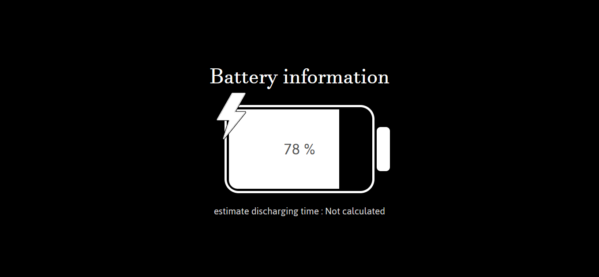

# Battery API Project

This project utilizes the Battery API to provide various functionalities related to monitoring the battery status of a device. With this API, you can access information such as battery level, track the estimated time until the battery is empty, and determine whether the device is currently plugged in or unplugged. Additionally, if the device is unplugged, a charging icon is displayed.

## Screenshot



[Go to app](https://devmrvicky.github.io/web-api-repo/Battery-api/)

## Features

1. **Battery Level**: This project allows you to view the current battery level of your device, giving you a percentage representation of how much battery power is remaining.

2. **Estimate Time**: You can track the estimated time until the battery is expected to run out based on the current battery level and usage.

3. **Plugged In/Out Detection**: The project provides real-time detection of whether the device is plugged in (charging) or unplugged (discharging). This information can be useful for optimizing power consumption or alerting users to connect their devices.

4. **Charging Icon**: When the device is unplugged, a charging icon is displayed to notify the user to connect the charger. This visual indicator helps users easily identify when their device needs charging.

## Using the Battery API

The Battery API allows you to access important battery-related information for a user's device, such as battery level, charging status, and estimated time until the battery is empty. To utilize this API, follow these simple steps:

1. **Accessing the Battery API**: Start by calling the `navigator.getBattery()` function. This function returns a Promise.

   ```javascript
   navigator.getBattery().then(function(battery) {
     // Your code to handle battery information goes here
   });
   ```

2. **Handling the Promise**: The `navigator.getBattery()` function returns a Promise that resolves when the battery information is available.

3. **Accessing Battery Properties**: Within the Promise's `.then()` method, you can access various battery properties, including:

   - `battery.level`: This property provides the current battery level as a value between 0 (empty) and 1 (full).

   - `battery.charging`: Use this property to determine whether the device is currently charging (true) or discharging (false).

   - `battery.chargingTime`: This property gives you an estimate of the time, in seconds, until the battery is fully charged (applicable when charging).

   - `battery.dischargingTime`: When the device is unplugged, this property estimates the time, in seconds, until the battery is empty.

4. **Example Usage**:

   ```javascript
   navigator.getBattery().then(function(battery) {
     // Access battery properties
     const batteryLevel = battery.level;
     const isCharging = battery.charging;
     const chargingTime = battery.chargingTime;
     const dischargingTime = battery.dischargingTime;

     // Your code to use the battery information goes here
   });
   ```

By following these steps, you can easily integrate the Battery API into your web application to provide users with valuable information about their device's battery status and optimize their user experience accordingly.