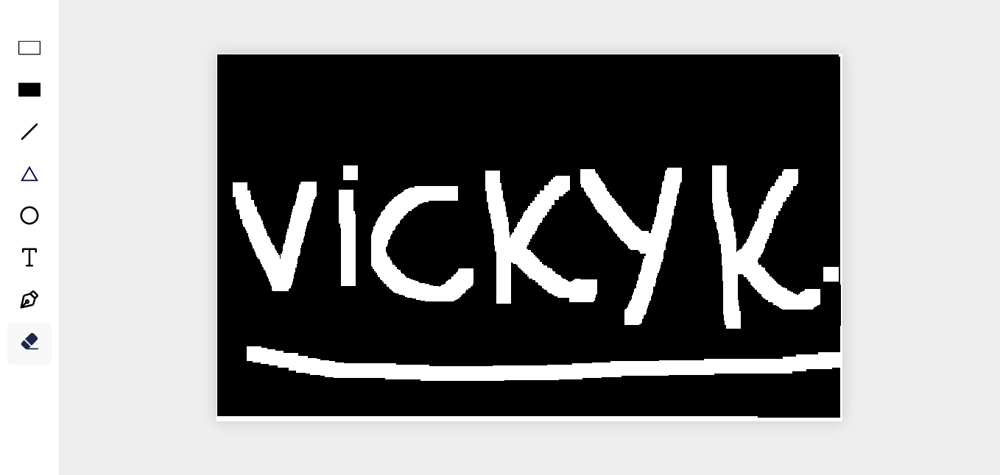

# Canvas API Drawing and Erasing Project

Welcome to the Canvas API Drawing and Erasing Project! This project demonstrates a simple web application that allows users to draw and erase shapes on an HTML `<canvas>` element using JavaScript and the Canvas API.

## Introduction

This project serves as a simple example of how to use the Canvas API to create a drawing and erasing application in a web browser. It allows users to draw various shapes, such as rectangles, circles, and lines, on a canvas, as well as erase them.

## Features

- Drawing various shapes: Users can select different shapes (e.g., rectangles, circles) and draw them on the canvas.
- Erasing shapes: Users can erase shapes that have been drawn on the canvas.

## Demo

[Canvas api project](https://devmrvicky.github.io/web-api-repo/Canvas-api/)

## Getting Started

### Prerequisites

Before running this project, ensure you have the following prerequisites:

- A modern web browser (e.g., Chrome, Firefox, Edge)
- An internet connection (for the live demo, if applicable)

### Installation

1. Clone the repository to your local machine:

   ```shell
   git clone https://github.com/your-username/canvas-drawing-project.git
   ```

2. Open the project folder in your code editor.

3. Open the `index.html` file in your web browser to run the application locally.

## Usage

### Drawing Shapes

1. Select a shape from the available options (e.g., rectangle, circle) by clicking on the shape buttons.

2. Choose a color and size for your shape using the color and size selectors.

3. Click and drag on the canvas to draw the selected shape. Release the mouse button to finish drawing.

4. You can draw multiple shapes with different colors and sizes.

### Erasing Shapes

1. Select the eraser tool by clicking on the "Eraser" button.

2. Click and drag the eraser tool over the shapes you want to erase. The shapes will be removed from the canvas.

3. To stop erasing, switch back to a drawing tool (e.g., rectangle, circle).

## Contributing

Contributions are welcome! If you'd like to contribute to this project, please follow these steps:

1. Fork the repository.
2. Create a new branch for your feature or bug fix.
3. Make your changes and commit them.
4. Push your changes to your fork.
5. Submit a pull request to the main repository.

## License

This project is licensed under the [MIT License](LICENSE).

---

Feel free to customize this README to provide additional details, screenshots, or any specific instructions related to your project. Providing clear documentation will help users and potential contributors understand how to use and contribute to your Canvas API project.